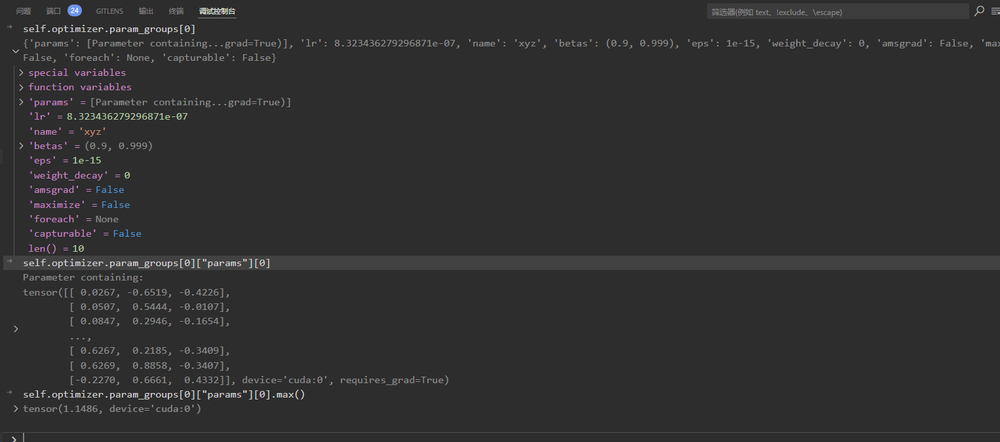
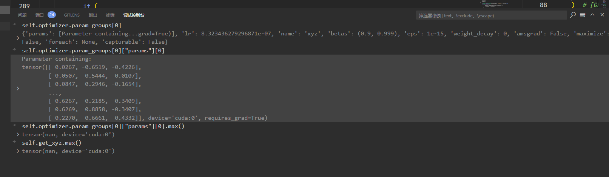

# 20241213 Debug 问题记录

第一轮正常，第一轮更新梯度后部分参数（xyz 和 roughness）出现非数 NaN。
第二轮出现问题。

更新前：


```python
def step(self):
    # 更新前
    self.optimizer.step()
    # 更新后
    self.optimizer.zero_grad()
```

更新后：


梯度里有非数
使用这个--detect_anomaly 来检查计算导数何时出现了 NaN
